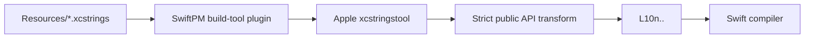

# SwiftLocalizedGenerator

[](https://swift.org)
[](#requirements)
[](https://github.com/Harry-KNIGHT/SwiftLocalizedGenerator/actions/workflows/ci.yml)
[](LICENSE)

A tiny SwiftPM build-tool plugin that turns Apple String Catalogs into a public,
type-safe `L10n` API at compile time.

```swift
Text(L10n.Onboarding.welcomeTitle)
Text(L10n.Cart.itemCount(items.count)) // Plural rules included
Text(L10n.Profile.greeting(user.displayName)) // Typed interpolation
```

SwiftLocalizedGenerator delegates parsing and symbol generation to Apple's
`xcstringstool`. It does not reimplement the `.xcstrings` format, plural rules,
format specifiers, or package-bundle lookup.

## Why

String Catalogs already contain everything needed for a safe localization API.
The missing piece is a lightweight way to make Apple's generated symbols public
and pleasant to consume across Swift packages.

- **No runtime dependency** — only a build-tool plugin.
- **No third-party parser** — Apple's tool remains the source of truth.
- **Native plurals and interpolation** — generated signatures come directly
  from the catalog.
- **Incremental builds** — one declared build command per catalog.
- **Module-safe resources** — generated values keep `Bundle.module` lookup.
- **No generated files in Git** — output stays in SwiftPM's plugin work
  directory.

## Quick start

Add the package dependency and attach the plugin to the target that owns your
String Catalogs:

```swift
// Package.swift
let package = Package(
    name: "MyApp",
    defaultLocalization: "en",
    dependencies: [
        .package(
            url: "https://github.com/Harry-KNIGHT/SwiftLocalizedGenerator.git",
            from: "0.1.0"
        )
    ],
    targets: [
        .target(
            name: "AppLocalization",
            resources: [.process("Resources")],
            plugins: [
                .plugin(
                    name: "SwiftLocalizedGeneratorPlugin",
                    package: "SwiftLocalizedGenerator"
                )
            ]
        )
    ]
)
```

Put one or more catalogs directly in the target's `Resources` directory:

```text
Sources/AppLocalization/
└── Resources/
    ├── Common.xcstrings
    ├── Onboarding.xcstrings
    └── Cart.xcstrings
```

Build once. The catalog filename becomes a namespace under `L10n`:

```swift
import AppLocalization

let title: LocalizedStringResource = L10n.Onboarding.welcomeTitle
let itemCount = L10n.Cart.itemCount(3)
```

There is no generated source file to add to the project. The plugin creates it
inside `.build` or Xcode's DerivedData and the Swift compiler includes it in the
target automatically.

## Generated API

`xcstringstool` determines the exact Swift spelling and function signature.
SwiftLocalizedGenerator only publishes that native output under `L10n`.

| Catalog and key | Generated API |
| --- | --- |
| `Common.xcstrings` + `retry` | `L10n.Common.retry` |
| `Onboarding.xcstrings` + `welcome_title` | `L10n.Onboarding.welcomeTitle` |
| `Profile.xcstrings` + `greeting` containing `%@` | `L10n.Profile.greeting(_:)` |
| `Cart.xcstrings` + plural `item_count` containing `%lld` | `L10n.Cart.itemCount(_:)` |

Pass generated `LocalizedStringResource` values directly to SwiftUI when
possible:

```swift
Text(L10n.Cart.itemCount(cart.items.count))
Button(L10n.Common.retry) {
    reload()
}
```

For an API that requires an immediate `String`:

```swift
let title = String(localized: L10n.Onboarding.welcomeTitle)
```

You can add project-specific helpers without editing generated code:

```swift
extension L10n {
    static func string(
        _ resource: LocalizedStringResource,
        locale: Locale = .current
    ) -> String {
        var resource = resource
        resource.locale = locale
        return String(localized: resource)
    }
}
```

## How it works



For each catalog, the plugin:

1. invokes `xcrun xcstringstool generate-symbols`;
2. preserves Apple's resource-bundle, interpolation, comments, and plural
   output;
3. moves the symbols from Apple's internal namespace to the generated public
   `L10n` namespace;
4. declares the catalog as an input and its Swift file as an output so SwiftPM
   can skip unchanged work.

The transformation intentionally recognizes a small, explicit shape. If a
future Xcode release changes Apple's generated source format, the build fails
with a useful error instead of exposing an incorrect API.

## Conventions

- Place catalogs directly under the target's `Resources` directory.
- Use `UpperCamelCase` ASCII catalog names such as `Account.xcstrings`.
- Use stable semantic keys; `lower_snake_case` works well with Apple's naming.
- Do not declare your own `L10n` enum. The plugin generates it for the target.
- Extend `L10n` when you need project-specific helpers.
- Treat `.xcstrings` files as the only source of catalog-specific symbols.

Changing a key or format placeholder can change the generated Swift API. That
is intentional: stale call sites fail at compile time.

## Requirements

- Swift 6.2 or newer
- Xcode 26 or newer; earlier Xcode releases do not provide the
  `xcstringstool generate-symbols` command used by the plugin
- macOS as the build host, because `xcstringstool` ships with Xcode
- iOS 16, macOS 13, tvOS 16, watchOS 9, or visionOS 1 for generated
  `LocalizedStringResource` APIs

The application may target Apple platforms, but generation itself cannot run
on Linux while it depends on Apple's toolchain.

## Validation

The repository includes both strict transformer tests and an end-to-end fixture
package with static strings, typed interpolation, and English/French plurals:

```sh
swift test
```

The fixture's generated signatures compile on macOS. Its localized runtime
values are additionally asserted when the tests run on iOS, where SwiftPM/Xcode
compile String Catalogs into the test bundle.

## Troubleshooting

**The symbols do not appear in autocomplete**

Build the package once so Xcode runs the plugin and refreshes the index. Xcode
may ask you to trust the package plugin the first time.

**The plugin cannot find any catalogs**

Confirm that at least one `.xcstrings` file is directly inside the target's
`Resources` directory and that the target processes that directory as a
resource.

**A catalog name is rejected**

Use an `UpperCamelCase` filename containing only ASCII letters and numbers, for
example `PurchaseHistory.xcstrings`.

**A generated function has an unexpected parameter type**

The type comes from the format specifier in the String Catalog. Inspect the key
in Xcode and keep placeholder types compatible across localizations.

**A clean build mentions an old package path**

Run `swift package clean`, then rebuild. Swift compiler module caches can retain
paths after moving a package.

## Documentation

- [Getting started and migration](Documentation/GettingStarted.md)
- [Contributing](CONTRIBUTING.md)
- [Changelog](CHANGELOG.md)

## License

SwiftLocalizedGenerator is available under the MIT License. See [LICENSE](LICENSE).
